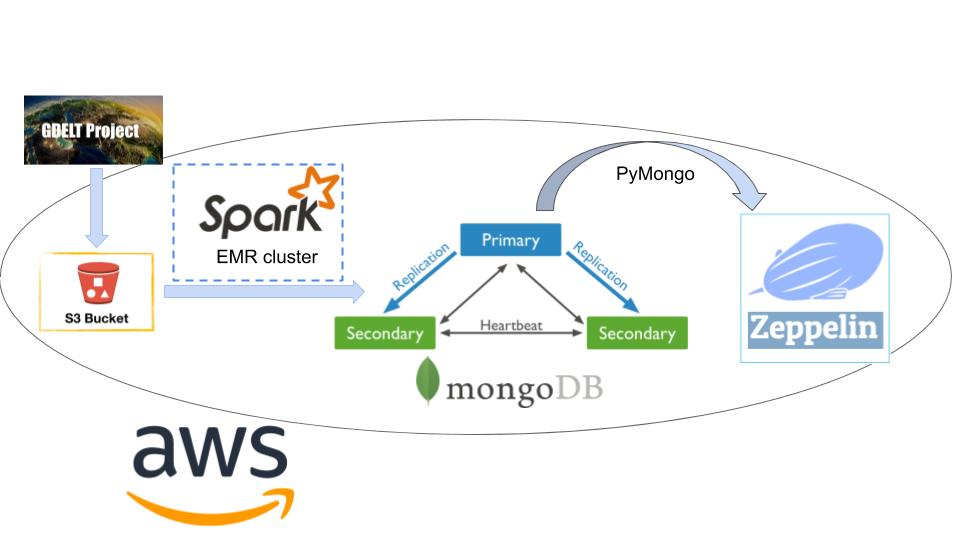

# ProjetNoSQL

This project consists of three major steps:

1. Download the gdelt csv files to AWS S3 bucket. 
2. Transfer the data from S3 to a MongoDB replica set with preprocessing by Spark scala.    
3. Explore data stored in MongoDB on AWS with four predefined queries.

The achitechture can be illustrated as : 

